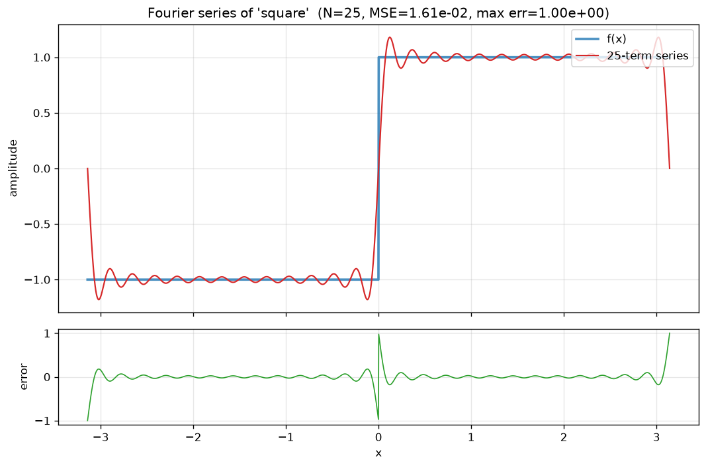
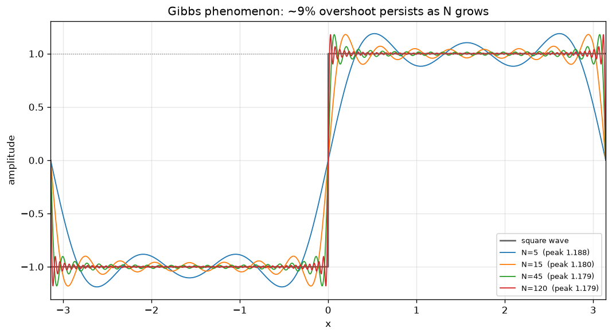
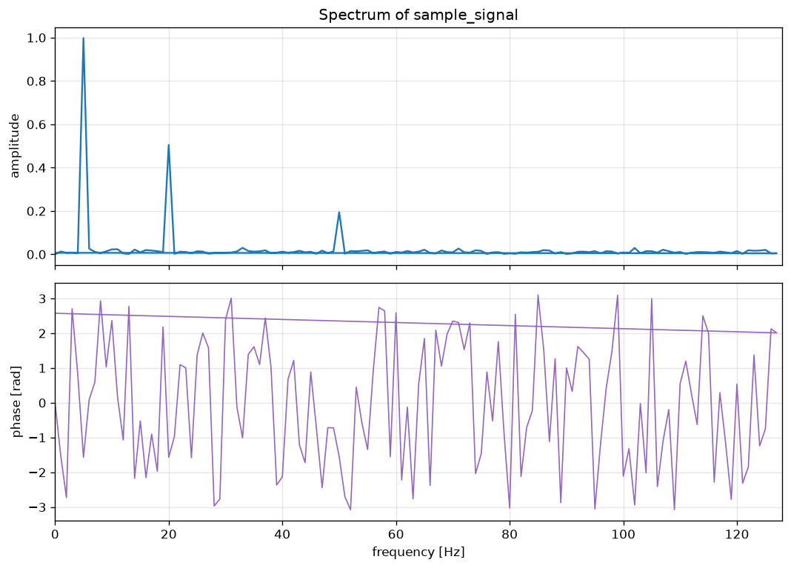
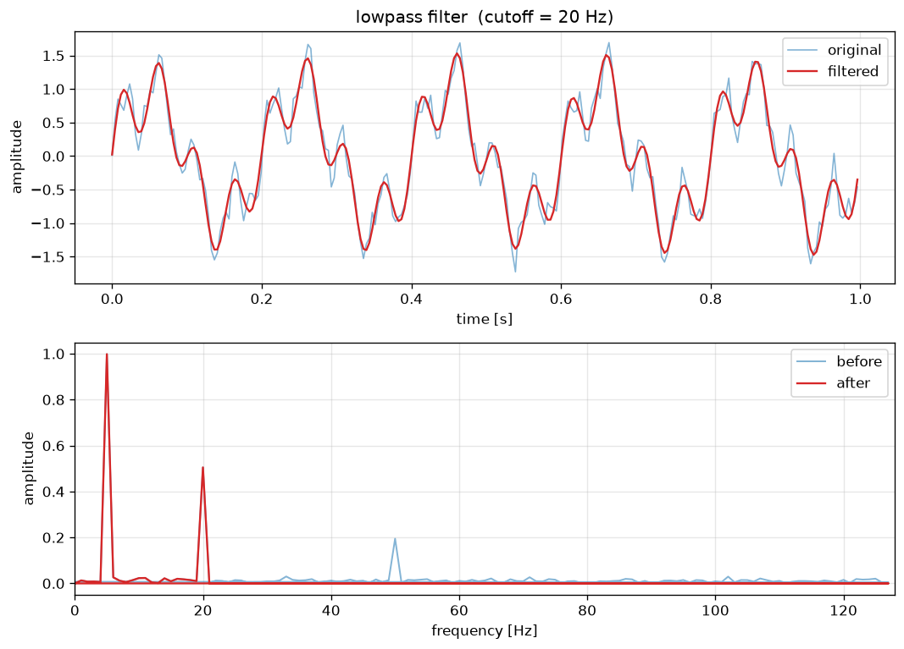
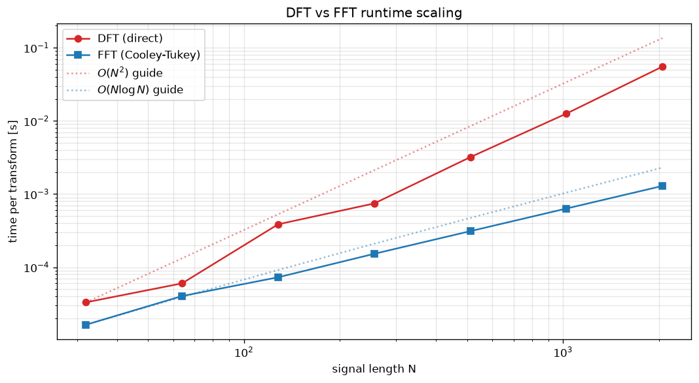
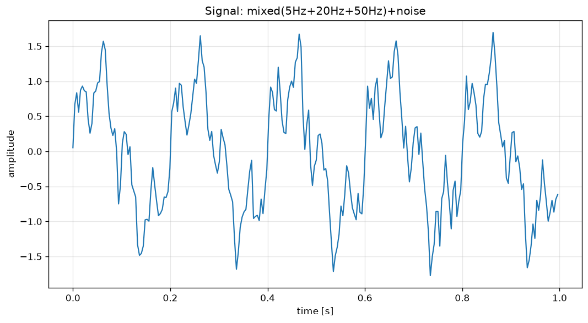

# FourierLab

**A computational mathematics toolkit for Fourier series, discrete Fourier
transforms, fast Fourier transforms, signal reconstruction, spectrum analysis,
and frequency-domain filtering.**

FourierLab implements the **DFT and FFT from scratch** (no `numpy.fft` in the
core), validates its results against NumPy, demonstrates the **Gibbs
phenomenon**, compares **O(N²) vs O(N log N)** algorithms head to head, and
exports clean visualizations for signals and spectra. It is built to be *read*
as much as *run* — a learning tool for students of Fourier analysis, numerical
methods, and signal processing.


```bash
python -m fourierlab fft --signal "1,0,-1,0"
python -m fourierlab series --function square --terms 25 --save square.png
python -m fourierlab compare --sizes 32 64 128 256 512 1024
```

---

## Table of contents

- [Why Fourier analysis matters](#why-fourier-analysis-matters)
- [Installation](#installation)
- [Quick start](#quick-start)
- [CLI reference](#cli-reference)
- [The mathematics](#the-mathematics)
- [Example gallery](#example-gallery)
- [Using FourierLab as a library](#using-fourierlab-as-a-library)
- [Testing](#testing)
- [Project structure](#project-structure)
- [Limitations](#limitations)
- [Future work](#future-work)
- [References](#references)
- [License](#license)

---

## Why Fourier analysis matters

Almost any signal — a sound wave, a stock price, a seismograph trace, a row of
pixels, an EKG — can be understood as a **sum of simple oscillations**. Fourier
analysis is the mathematical dictionary that translates between the *time domain*
(what the signal looks like as it evolves) and the *frequency domain* (which
oscillations it is built from, and how strong each one is).

That translation is the backbone of an enormous amount of modern technology:

- **Audio & music**: equalizers, pitch detection, MP3/AAC compression, noise removal.
- **Images & video**: JPEG and MPEG both rely on frequency-domain transforms.
- **Communications**: Wi-Fi, 4G/5G, and DSL split data across frequency bands.
- **Science & engineering**: vibration analysis, spectroscopy, medical imaging (MRI), radar/sonar.
- **Numerical methods**: fast convolution, solving PDEs, interpolation.

The **Fast Fourier Transform** — which turns an `O(N²)` computation into
`O(N log N)` — is frequently cited as one of the most important algorithms of
the 20th century. FourierLab exists to make these ideas concrete: you can read
the ~40 lines that *are* the FFT, run them, and watch them beat the slow DFT on
a plot.

---

## Installation

FourierLab targets **Python 3.10+** and depends only on **NumPy** and
**Matplotlib** (plus **pytest** for the test suite).

```bash
# 1. Clone
git clone https://github.com/yourname/FourierLab.git
cd FourierLab

# 2. (Recommended) create a virtual environment
python -m venv .venv
source .venv/bin/activate        # on Windows: .venv\Scripts\activate

# 3. Install the package (editable install for development)
pip install -e .

# ...or install with the test extras
pip install -e ".[test]"
```

Verify the install:

```bash
python -m fourierlab --help
python -m fourierlab --version
```

You can invoke the tool either as `python -m fourierlab ...` or via the
installed console script `fourierlab ...`.

---

## Quick start

```bash
# 1. Synthesize a noisy three-tone signal and save it as CSV
python -m fourierlab generate --kind mixed --freqs 5,20,50 --amps 1,0.5,0.2 \
    --noise 0.1 --save data/sample_signal.csv

# 2. Look at its frequency spectrum
python -m fourierlab spectrum --input data/sample_signal.csv --save spectrum.png

# 3. Low-pass filter it to remove the 50 Hz tone and the high-frequency noise
python -m fourierlab filter --input data/sample_signal.csv --type lowpass \
    --cutoff 20 --save filtered.png --export filtered.csv

# 4. Watch the FFT crush the DFT as N grows
python -m fourierlab compare --sizes 32 64 128 256 512 1024 --save speed.png
```

A transform command prints a compact, readable report:

```text
FourierLab :: FFT

input length       = 8
sample rate        = 100 Hz
method             = recursive Cooley-Tukey FFT
power of two       = yes
max NumPy error    = 2.31e-15
reconstruct err    = 1.05e-16

   k    freq[Hz]        real        imag      |X_k|  phase[rad]
   0           0      0.0000      0.0000     0.0000      0.0000
   ...

dominant frequencies:
    10.000 Hz   amplitude 0.9980
    20.000 Hz   amplitude 0.5020
```

---

## CLI reference

| Command | Purpose |
|---|---|
| `series`   | Approximate a periodic function by an N-term Fourier series |
| `gibbs`    | Demonstrate the Gibbs overshoot near a discontinuity |
| `dft`      | Discrete Fourier Transform of a signal (from scratch) |
| `idft`     | Inverse DFT |
| `fft`      | Fast Fourier Transform, recursive Cooley-Tukey (from scratch) |
| `ifft`     | Inverse FFT |
| `compare`  | Benchmark DFT vs FFT across signal sizes |
| `generate` | Synthesize sine/cosine/square/sawtooth/triangle/mixed signals |
| `spectrum` | Magnitude + phase spectrum of a signal from CSV |
| `filter`   | Low/high/band-pass/band-stop frequency-domain filtering |

Run `python -m fourierlab <command> --help` for the full option list. A few
worked examples:

```bash
# Fourier series with a chosen number of harmonics
python -m fourierlab series --function square --terms 25 --save square.png
python -m fourierlab series --function triangle --terms 10 --method analytical

# Transforms of an explicit signal (real or complex, e.g. "1+1j,0,-1,0")
python -m fourierlab dft --signal "1,0,-1,0"
python -m fourierlab fft --signal "1,0,-1,0" --sample-rate 4

# Signal generation
python -m fourierlab generate --kind sine --frequency 10 --sample-rate 100 \
    --duration 1 --save data/sine.csv
python -m fourierlab generate --kind mixed --freqs 5,20,50 --amps 1,0.5,0.2 \
    --noise 0.1 --seed 0 --save data/sample_signal.csv

# Spectrum and filtering from a CSV file
python -m fourierlab spectrum --input data/sine.csv --save spectrum.png
python -m fourierlab filter --input data/sample_signal.csv --type bandpass \
    --low 10 --high 30 --save band.png --export band.csv
```

### Signal CSV format

Signals are stored as a simple, self-describing two-column CSV:

```text
# FourierLab signal 'mixed(5Hz+20Hz+50Hz)'
# sample_rate=256.0
t,y
0.0,0.012573
0.00390625,0.533207
...
```

The `sample_rate` comment is authoritative; if it is missing (e.g. for
hand-written data) the rate is inferred from the spacing of the `t` column.

---

## The mathematics

### Fourier series

A periodic function can be approximated by adding sine and cosine waves of
different frequencies. In real form,

$$
f(x) \;\approx\; \frac{a_0}{2} + \sum_{n=1}^{N}
\Big[\, a_n \cos(n\omega x) + b_n \sin(n\omega x) \,\Big],
\qquad \omega = \frac{2\pi}{T},
$$

with coefficients (shown for the canonical period $T = 2\pi$, so $\omega = 1$)

$$
a_n = \frac{1}{\pi}\int_{-\pi}^{\pi} f(x)\cos(nx)\,dx,
\qquad
b_n = \frac{1}{\pi}\int_{-\pi}^{\pi} f(x)\sin(nx)\,dx.
$$

$a_0/2$ is just the average value of $f$ over one period. **More terms usually
improve the approximation**, but a function with a jump discontinuity never
converges uniformly — see [Gibbs](#gibbs-phenomenon) below.

FourierLab estimates these integrals numerically (so it works for *any* sampled
function) and also carries the exact closed forms for the classic waveforms, for
example the square wave

$$
\text{square}(x) = \frac{4}{\pi}\sum_{k=0}^{\infty}\frac{\sin\big((2k+1)x\big)}{2k+1}
= \frac{4}{\pi}\left(\sin x + \tfrac{1}{3}\sin 3x + \tfrac{1}{5}\sin 5x + \cdots\right).
$$

| Waveform | Nonzero coefficients (period $2\pi$, unit amplitude) |
|---|---|
| sine     | $b_1 = 1$ |
| cosine   | $a_1 = 1$ |
| square   | $b_n = \dfrac{4}{n\pi}$ for odd $n$ |
| sawtooth | $b_n = \dfrac{2(-1)^{n+1}}{n\pi}$ |
| triangle | $a_n = \dfrac{8}{\pi^2 n^2}$ for odd $n$ |

### DFT

The **Discrete Fourier Transform** converts a finite list of $N$ samples from
the time domain into the frequency domain. Each output coefficient $X_k$ tells
you how much of a certain frequency is present in the signal:

$$
X_k = \sum_{n=0}^{N-1} x_n \, e^{-2\pi i k n / N},
\qquad k = 0, 1, \dots, N-1,
$$

and the **inverse DFT** rebuilds the signal exactly:

$$
x_n = \frac{1}{N}\sum_{k=0}^{N-1} X_k \, e^{+2\pi i k n / N}.
$$

FourierLab forms the $N\times N$ matrix $W_{kn} = e^{-2\pi i kn/N}$ and computes
$X = W x$ — the definition, done directly. That is $O(N^2)$ work, which is
exactly what the FFT improves upon.

### FFT

The **Fast Fourier Transform** computes the *same coefficients* as the DFT, but
much faster, by recursively splitting the signal into its even- and odd-indexed
samples (radix-2 Cooley–Tukey):

$$
X_k = E_k + W_N^{\,k}\,O_k, \qquad
X_{k+N/2} = E_k - W_N^{\,k}\,O_k, \qquad
W_N^{\,k} = e^{-2\pi i k/N},
$$

where $E$ is the DFT of the even samples and $O$ the DFT of the odd samples.
Unrolling the recursion gives the famous cost reduction:

$$
O(N^2) \;\longrightarrow\; O(N \log N).
$$

The recursion requires the length to be a **power of two**; FourierLab raises a
clear error otherwise (and its general-purpose dispatcher falls back to the DFT
for other lengths). The inverse FFT reuses the forward transform via
$\operatorname{ifft}(X) = \tfrac{1}{N}\,\overline{\operatorname{fft}(\overline{X})}$.

### Magnitude and phase spectrum

Each DFT coefficient is a complex number $X_k = |X_k|\,e^{i\phi_k}$.

- The **magnitude spectrum** $|X_k|$ shows the *strength* of each frequency
  component. FourierLab also reports a *single-sided amplitude spectrum*, scaled
  so a pure tone of amplitude $A$ reads back as height $A$.
- The **phase spectrum** $\phi_k = \arg(X_k)$ shows the *shift / alignment* of
  each component.

### Filtering

A frequency-domain filter transforms a signal with the FFT, **keeps or zeros
selected frequency bins**, and reconstructs with the inverse transform:

$$
x \;\xrightarrow{\text{FFT}}\; X \;\xrightarrow{\text{mask}}\; X' \;\xrightarrow{\text{IFFT}}\; x'.
$$

FourierLab provides ideal ("brick-wall") **low-pass**, **high-pass**,
**band-pass**, and **band-stop** filters. The keep/reject decision is made on the
*absolute* frequency $|f|$, which keeps the mask conjugate-symmetric and
guarantees the filtered signal stays real.

### Gibbs phenomenon

Fourier series approximations of functions with jump discontinuities **overshoot
near the jump**, even as the number of terms increases. The overshoot does not
disappear — it converges to about **9% of the jump** — it merely becomes
*narrower*. For the unit square wave the partial-sum peak converges to

$$
\frac{2}{\pi}\int_0^{\pi}\frac{\sin t}{t}\,dt = \frac{2}{\pi}\operatorname{Si}(\pi) \approx 1.1790.
$$

Run `python -m fourierlab gibbs --terms 5 15 45 120` to watch it happen.

### Nyquist and aliasing

A signal sampled at rate $f_s$ can only faithfully represent frequencies **below
half the sampling rate**, the *Nyquist frequency* $f_s/2$. Content above Nyquist
is not lost — it is **aliased**, folding down and masquerading as a lower
frequency. This is why the spectrum and filter commands only report / act on
frequencies up to $f_s/2$, and why the filters reject cutoffs above Nyquist with
an error.

---

## Example gallery

See [`examples/`](examples/README.md) for the commands that generate each of
these.

| | |
|---|---|
| **Fourier series (square, N=25)** | **Gibbs phenomenon** |
|  |  |
| **Frequency spectrum** | **Low-pass filter** |
|  |  |
| **DFT vs FFT runtime** | **Synthesized mixed signal** |
|  |  |

---

## Using FourierLab as a library

Everything the CLI does is available programmatically, with type hints and
docstrings throughout.

```python
import numpy as np
from fourierlab import fft, ifft, dft, idft, apply_filter
from fourierlab.signals import mixed
from fourierlab.series import approximate
from fourierlab.math_utils import amplitude_spectrum, dominant_frequencies

# --- transforms ---------------------------------------------------------
x = np.array([1.0, 0.0, -1.0, 0.0])
X = dft(x)                      # from-scratch DFT  -> [0, 2, 0, 2]
assert np.allclose(ifft(fft(x)), x)     # exact round-trip

# --- spectrum analysis --------------------------------------------------
sig = mixed([5, 20, 50], [1.0, 0.5, 0.2], sample_rate=256, duration=2)
spectrum = fft(sig.y)
print(dominant_frequencies(spectrum, sig.sample_rate, count=3))
# [Peak(frequency=5.0, amplitude=1.0), Peak(frequency=20.0, amplitude=0.5), ...]

# --- Fourier series -----------------------------------------------------
approx = approximate("square", num_terms=25)
print(approx.mse, approx.max_error)

# --- filtering ----------------------------------------------------------
result = apply_filter(sig, "lowpass", cutoff=30)
clean = result.filtered.y        # 50 Hz tone removed
```

---

## Testing

The suite has **163 deterministic tests** (random seeds fixed everywhere) and
runs in about a second.

```bash
pip install -e ".[test]"
python -m pytest              # run everything
python -m pytest -v           # verbose
python -m pytest tests/test_fft.py    # a single module
```

What the tests verify:

- **DFT** — matches `numpy.fft` within tolerance; inverse reconstructs the
  input; handles real *and* complex signals; correct magnitude for pure tones;
  Parseval's energy identity holds.
- **FFT** — matches both NumPy and our own DFT; inverse reconstructs the input;
  rejects non-power-of-two lengths with a useful error; is measurably faster
  than the DFT for large inputs.
- **Fourier series** — numerical coefficients match the analytical formulas; the
  square/triangle/sawtooth approximations improve with more terms; a sinusoid is
  recovered with a couple of terms; the Gibbs overshoot has the expected ~1.179
  peak and persists as `N` grows.
- **Filters** — low-pass removes highs, high-pass removes lows, band-pass keeps
  the band, band-stop removes it; length is preserved; the output is real;
  invalid cutoffs raise clear errors.
- **CLI** — core commands run and print sensible output; invalid input yields a
  clean `error:` message (not a traceback); saved files are actually created.

---

## Project structure

```text
FourierLab/
├── fourierlab/
│   ├── __init__.py       # public API surface
│   ├── __main__.py       # enables `python -m fourierlab`
│   ├── cli.py            # argparse CLI + polished console reports
│   ├── signals.py        # Signal container, waveform generators, CSV I/O
│   ├── series.py         # real Fourier series, coefficients, Gibbs
│   ├── dft.py            # DFT / inverse DFT, from the definition
│   ├── fft.py            # recursive Cooley-Tukey FFT / IFFT + benchmarking
│   ├── filters.py        # low/high/band-pass/band-stop filters
│   ├── visualize.py      # matplotlib plotting (Agg, headless-safe)
│   ├── math_utils.py     # frequency bins, spectra, error metrics, Parseval
│   └── errors.py         # typed exception hierarchy
├── tests/                # pytest suite (dft, fft, series, filters, signals, cli)
├── data/
│   └── sample_signal.csv # a ready-to-use three-tone noisy signal
├── examples/             # generated plots + the commands that made them
├── README.md
├── pyproject.toml
├── requirements.txt
└── .gitignore
```

The design keeps a **clean separation** between the math (`dft`, `fft`, `series`,
`filters`, `math_utils`), file I/O (`signals`), plotting (`visualize`), and the
CLI (`cli`). No `numpy.fft` is used inside the core transforms — NumPy appears
only as array storage and, in the tests, as an independent oracle.

---

## Limitations

- **Radix-2 FFT only.** The fast path requires power-of-two lengths. Other
  lengths transparently fall back to the `O(N²)` DFT rather than a mixed-radix or
  Bluestein FFT, so very large non-power-of-two signals are slow.
- **Ideal (brick-wall) filters.** The filters zero frequency bins with an
  infinitely sharp edge. This is perfect for teaching but causes time-domain
  ringing; production DSP uses smoother FIR/IIR filters (Butterworth, etc.).
- **Educational performance.** The transforms are written for clarity; a pure
  Python recursive FFT is far slower than FFTW or `numpy.fft`. FourierLab is for
  understanding, not for high-throughput production pipelines.
- **1-D, uniformly sampled, single-channel.** No 2-D transforms, non-uniform
  sampling, or multi-channel audio in the core.
- **No anti-aliasing on synthesis.** Generated square/sawtooth waves contain
  ideal harmonics above Nyquist and can alias if sampled coarsely.

---

## Future work

Planned once the core is solid (see the roadmap in the code comments):

- Window functions (Hann, Hamming, Blackman) for spectral leakage control
- Spectrogram / short-time Fourier transform
- The convolution theorem as a runnable demo
- 2-D FFT and a basic image-frequency demo
- WAV audio loading and spectrum analysis
- Fourier epicycle ("drawing with circles") animation
- Symbolic Fourier series via SymPy
- Mixed-radix / Bluestein FFT for arbitrary lengths

---

## References

FourierLab was written from the standard definitions, cross-checked against
NumPy, and informed by these excellent resources:

- Allen Downey — *Think DSP* — https://github.com/AllenDowney/ThinkDSP
- SciPy Lecture Notes — https://github.com/scipy-lectures/scientific-python-lectures
- J. Vierine — *Signal Processing Course* — https://github.com/jvierine/signal_processing_course
- O. Alkousa — *Learn Fourier Transform* — https://github.com/OmarAlkousa/Learn-Fourier-Transform
- Cooley, J. W., & Tukey, J. W. (1965). *An algorithm for the machine calculation
  of complex Fourier series.* Mathematics of Computation, 19(90), 297–301.

---

## License

Released under the **MIT License**. See [`LICENSE`](LICENSE) for details.
